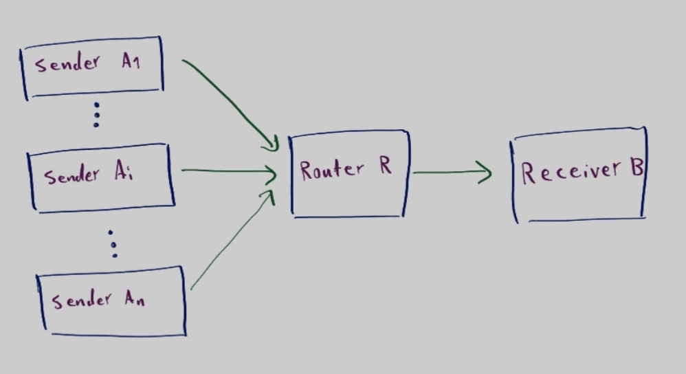

# Random Early Detection
[Random early detection (RED)](https://en.wikipedia.org/wiki/Random_early_detection) is a queuing discipline for a network scheduler suited for congestion avoidance.

## How This Works?
This implementation is based on the Go-Back-N protocol implemented in [https://github.com/kymmt80/GoBackN-Protocol](https://github.com/kymmt80/GoBackN-Protocol).



Any number of senders can connect to the router. Due to the possible high number of messages, RED is used to avoid congestion.

Each sender, reads content from `test/francais.txt` and sends them to the router R in chunks of size 1500 bytes (specified in `defs.hpp`). The router stores each received frame in its buffer unless the buffer size exceeds a certain number. In this case, the router drops the received frame with probability P, where P is a linear function of the current queue-length. Upon receival (:-?), receiver B sends an acknowledgment (ACK) for each packet received. Sender A, detects if a packet is dropped by the router using some mechanism, and re-transmits as specified in the Go-Back-N protocol.


## How to Run?
Make sure you are in the main directory of the repository.
```
$ cd test
$ bash run_tests.sh
```